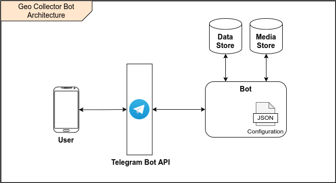
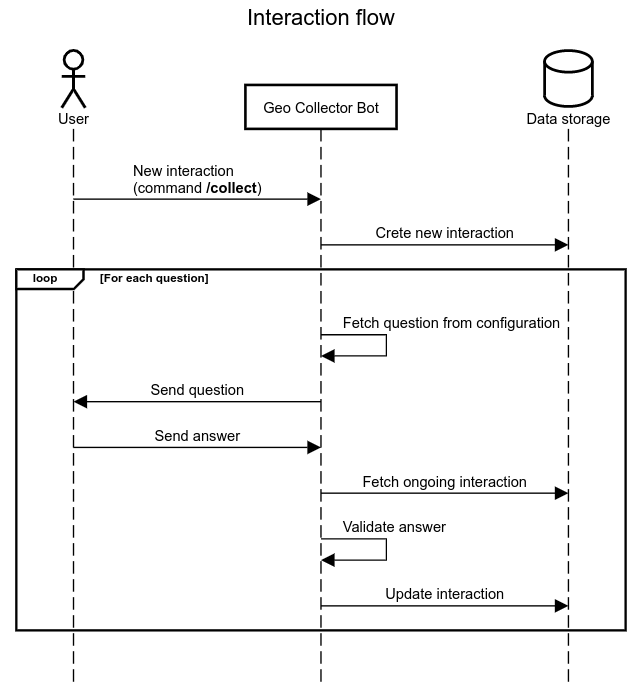

# Geo Collector Bot

Geo Collector Bot is a configurable [Telegram Bot](https://core.telegram.org/bots) designed to allow users to collect
*geodata* on the field.

The Bot poses a series of questions to the user and persists the answers to a database. Both the flow of questions and
the persistence are [configurable](./30_configuration.md). 

## Architecture

It follows a basic, high-level architecture of the Bot.



All the communications between the end user and the Bot are disintermediated by the *Telegram Bot API*, while the Bot
communicates directly with a database for *data storage* and, optionally, one for *media file storage*.

## How it works

Under the hood, the Bot manages a [finite-state machine](https://en.wikipedia.org/wiki/Finite-state_machine) received
through the configuration. The *states* of the machine are the questions posed to the user, and the answers are what
causes the *transitions* between states.

It follows a sequence diagram that shows the internal flow of the Bot when a user issues a new interaction with the
`/collect` command (remember that all the communications between the user and the Bot pass through the *Telegram Bot API*).



To better understand the flow, lets consider a Bot with the following basic configuration (for a detailed explanation see
the [relevant section](./30_configuration.md)).

```json
{
  "dataStorage": { ... },
  "flow": {
    "firstStepId": "description",
    "steps": [
      {
        "id": "description",
        "question": "Please, describe the issue",
        "config": { 
          "type": "text"
        },
        "nextStepId": "location"
      },
      {
        "id": "location",
        "question": "Please, provide your precise location",
        "config": { 
          "type": "location"
        }
      }
    ]
  }
}
```

Whenever a user sends the `/collect` command, the Bot starts a new interaction. Firstly, it checks if the user already has
an ongoing interaction, in which case it sends back an error to the user. If no interaction is found on the database, the
Bot creates a new one using the **id of the chat** as key to link the interaction and the user. 

On our database we have a new record with the following structure:

```json5
{
  "id": "123", // Unique identifier of the interaction
  "chatId": "456", // Unique identifier of the user's chat
  "username": "user_name", // Username of the user performing the interactions
  "currStepId": "description", // Id of the current step (in this case equal to the id of the first step)
  "interactionState": "ongoing", // State of the interaction
}
```

The Bot reads the configuration to find the first step and sends to the user the first question (*Please, describe the issue*,
in our example).

Being the Bot stateless, it now looses any knowledge about the interaction or the users, and just keep listening for new
messages. This means that the user can respond to the question asynchronously, at any time it wants.

When the user does respond, the Bot queries the database to find an interaction with `interactionState` equals to
`ongoing` and `chatId` equals to the identifier of the user's chat. If none is found, an error is sent back, otherwise,
the answer is validated against the current step configuration (in our example, the answer has to be a text message).

Once the answer has been successfully validated, the Bot finds the next step (step `location` in our example), and updates
the interaction on the database. The record will now be:

```json5
{
  "id": "123", // Unique identifier of the interaction
  "chatId": "456", // Unique identifier of the user's chat
  "username": "user_name", // Username of the user performing the interactions
  "currStepId": "location", // Id of the current step (in this case equal to the id of the second step)
  "interactionState": "ongoing", // State of the interaction
  "description": "Answer to the first question"
}
```

The process is repeated for the location step:
- the user receives the message *Please, provide your precise location*,
- the provided answer is checked to be a valid location, and
- since the step is the last, no other question is sent to the user.

The record is updated for the last time ending up being:

```json5
{
  "id": "123", // Unique identifier of the interaction
  "chatId": "456", // Unique identifier of the user's chat
  "username": "user_name", // Username of the user performing the interactions
  "currStepId": "location", // Id of the current step (in this case equal to the id of the last step)
  "interactionState": "completed", // State of the interaction
  "description": "Answer to the first question",
  "location": "User's provided location"
}
```
